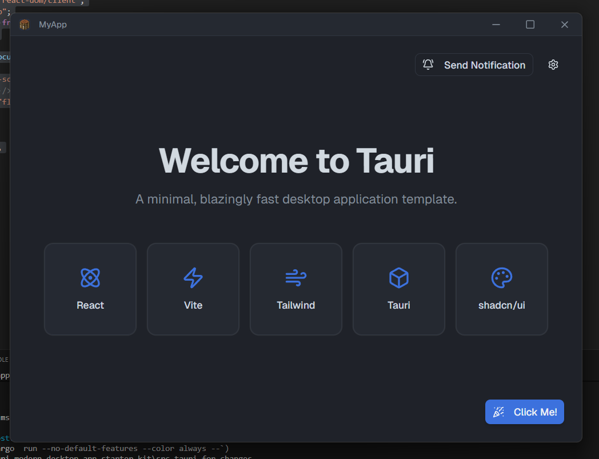
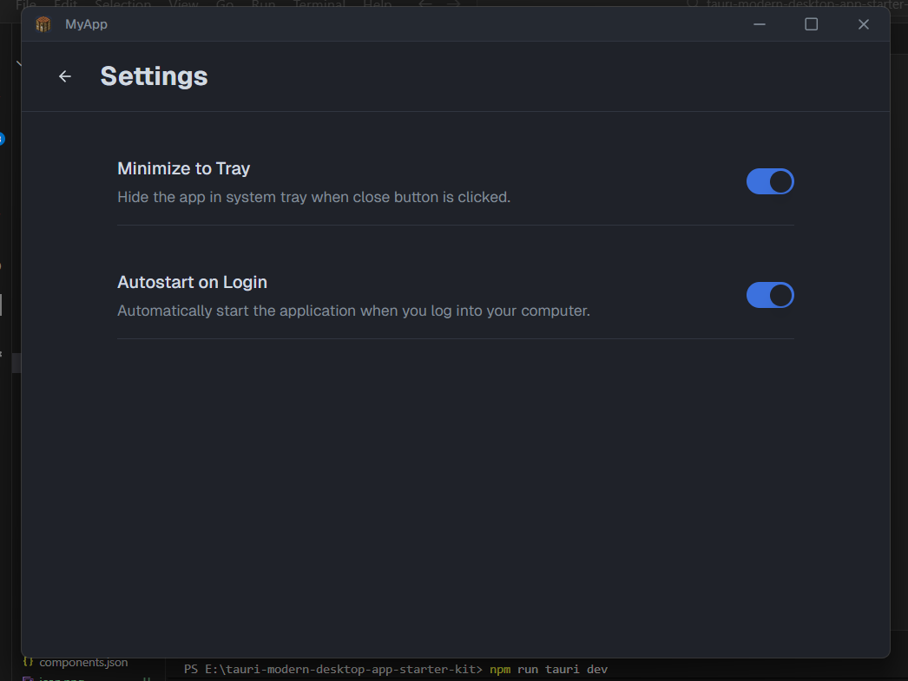

<p align="center">
  
  <h1 align="center">Modern Tauri Desktop App template</h1>
</p>
<br clear="all">

A minimal, easy to use starter template for building desktop applications using Tauri, React, and Vite.

## Screenshots

<p align="center">
  
  
</p>

## Features

- Built with modern React, Vite, and Tauri v2.
- Simple, straightforward project structure.
- Pre-configured custom titlebar.
- Vs Code-like shadcn color styles Out of the box.
- Integrated system tray icon with "minimize to tray" toggle.
- OS Autostart toggle.
- easy to use.

## Getting Started

### Prerequisites

Please ensure you follow the [Tauri setup guide](https://v2.tauri.app/start/prerequisites/) for your operating system properly before proceeding. You will need Node.js and Rust installed on your machine.

### Installation & Running

1. **Clone the repository:**
   ```bash
   git clone https://github.com/DaksshDev/tauri-modern-desktop-app-starter-kit.git
   cd tauri-modern-desktop-app-starter-kit
   ```
2. **Install dependencies:**
   ```bash
   npm install
   ```
3. **Run the app in development mode:**
   ```bash
   npm run tauri dev
   ```

### Building for Production

To build the executable for your current operating system, run:
```bash
npm run tauri build
```

## Customizing Your App

You can easily adapt this template to suit your needs:

1. **App Icon**: You can generate your custom app with a custom icon by running the following command with your image path (for example, with `./icon.png`):
   ```bash
   npm run tauri icon ./icon.png
   ```
2. **HTML Meta Setup**: Remember to modify the `<title>` and update the favicon link in `./index.html` too.
3. **App Config**: Open `./src-tauri/tauri.conf.json` and configure your app's `productName` and `identifier`.
4. **Titlebar Config**: Open `./src/window/Titlebar.jsx` and modify the Logo and Title fields and add your logo to `./src/window/icon.png`.
5. **Theming**: You can add your own color scheme by modifying the CSS variables inside `./src/styles.css`.

## Contributing

Contributions are welcome. If you find a bug or have an idea to improve this template, please feel free to open an issue or submit a pull request.

If you liked this repo please give it a star! ⭐